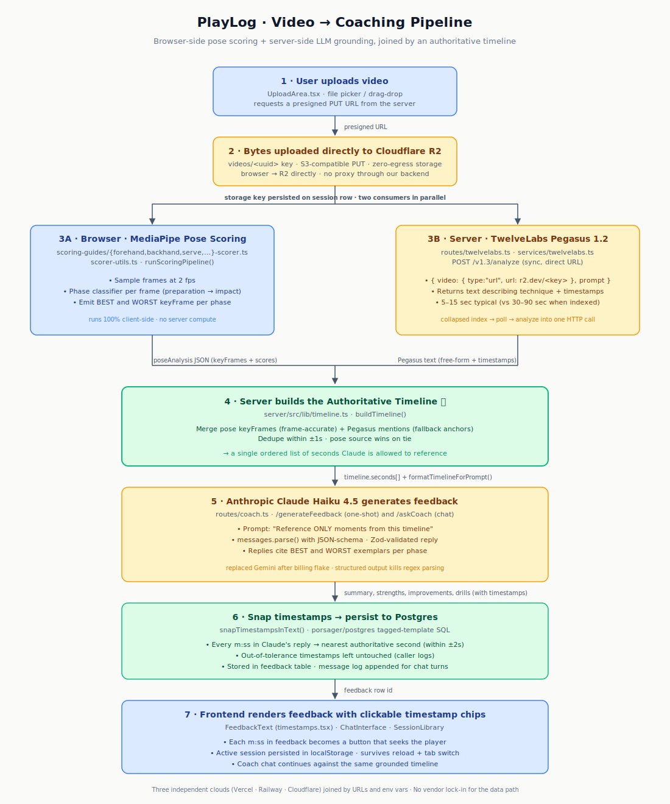

# PlayLog

> Presented at TwelveLabs' Multimodal Weekly and DiamondHacks 2026

> **AI-powered sports coaching for the browser.** Upload a clip of yourself playing — PlayLog scores your form frame by frame, builds an authoritative timeline of every key moment, and an LLM coach gives you grounded, growth-oriented feedback you can click through to the exact second on the video.

PlayLog combines in-browser computer vision (MediaPipe pose detection) with a video-understanding model (TwelveLabs Pegasus) and a coaching LLM (Anthropic Claude) — joined together by a small Hono server, Postgres for state, and Cloudflare R2 for video bytes.

---

## Table of contents

- [Stack](#stack)
- [Architecture](#architecture)
- [Project structure](#project-structure)
- [Quickstart](#quickstart)
- [Configuration](#configuration)
- [Scripts](#scripts)
- [Testing](#testing)
- [Deployment](#deployment)
- [Engineering reflection](#engineering-reflection)

---

## Stack

| Layer | Technology | Notes |
|---|---|---|
| Frontend | React 18 · Vite · TypeScript · Tailwind | Hosted on Vercel |
| API | Hono on Node 20+ | Hosted on Railway |
| Database | Postgres | Any provider that speaks plain Postgres (Railway, Supabase, Neon) |
| Object storage | Cloudflare R2 (S3-compatible) | Zero egress fees; public r2.dev or custom-domain hostname |
| Pose detection | MediaPipe BlazePose | Runs entirely client-side in the browser |
| Video understanding | TwelveLabs Pegasus 1.2 | Sync `/analyze` with direct `video.url` (no indexing) |
| Coaching LLM | Anthropic Claude Haiku 4.5 | Structured output via `messages.parse()` + Zod |

---

## Architecture

The full request path from upload to coaching feedback:



The defining design choice is that **MediaPipe pose scoring runs entirely in the browser**. This keeps the server stateless and GPU-free — the only server-side cost per session is the Anthropic call (cents). It also lets the frontend upload bytes directly to R2 via a presigned PUT URL, with no proxy through our backend.

The other defining choice is the **authoritative timeline** in `server/src/lib/timeline.ts`. Pose key-frames (frame-accurate) and Pegasus mentions (free-form) are merged into a single ordered list of seconds, which is then passed into Claude's prompt as the *only* allowed reference points. Every `m:ss` Claude emits is post-validated by snapping it to the nearest authoritative anchor within ±2 seconds. This pattern — *prompt-side constraint plus machine-validated rewriting* — is what makes the coaching feel trustworthy rather than plausible-sounding.

---

## Project structure

```
PlayLog/
├── server/                       # Hono backend
│   ├── src/
│   │   ├── routes/               # one Hono router per domain
│   │   │   ├── users.ts
│   │   │   ├── sessions.ts       # createSession, deleteSession, list
│   │   │   ├── analyses.ts
│   │   │   ├── messages.ts
│   │   │   ├── feedback.ts
│   │   │   ├── goals.ts
│   │   │   ├── badges.ts
│   │   │   ├── storage.ts        # presigned R2 URLs
│   │   │   ├── twelvelabs.ts     # analyzeDirect: video URL → text
│   │   │   └── coach.ts          # generateFeedback + askCoach
│   │   ├── services/             # external API integrations
│   │   ├── db/                   # postgres client, schema.sql, migrate, mappers
│   │   ├── storage/              # R2 client + presigned URL helpers
│   │   ├── jobs/                 # cron-runnable scripts
│   │   │   └── r2-cleanup.ts     # deletes orphaned video objects
│   │   └── lib/                  # env, errors, rpc, timeline grounding
│   ├── tests/                    # vitest with mocked fetch + sql
│   └── package.json
├── frontend/                     # React + Vite app
│   ├── src/
│   │   ├── components/           # tabs, video player, chat, session library
│   │   ├── hooks/                # useVideoAnalysis, useMediaPipe
│   │   └── lib/
│   │       ├── api/              # typed RPC client + React hooks
│   │       ├── mediapipe/        # pose detection + scoring guides
│   │       └── timestamps.tsx    # m:ss chip parser, click-to-seek
│   └── package.json
├── docs/
│   └── images/
│       └── architecture-flowchart.svg
└── package.json                  # root scripts that fan out to each package
```

The frontend talks to the backend over a small RPC convention: every endpoint is `POST /api/<module>/<name>` with a JSON body. The `api` object in `frontend/src/lib/api/api.ts` declares typed descriptors (`defQuery` / `defMutation` / `defAction`); React components consume them with `useQuery` / `useMutation` / `useAction` hooks built on top of TanStack Query.

---

## Quickstart

**Prerequisites:** Node ≥ 20.12, a Postgres database, a Cloudflare R2 bucket with a token, a TwelveLabs API key, an Anthropic API key.

```bash
# 1. Clone and install
git clone https://github.com/skytraan/PlayLog.git
cd PlayLog
npm --prefix server   install
npm --prefix frontend install

# 2. Configure
cp server/.env.example server/.env
cp frontend/.env.example frontend/.env
# fill in the values (see Configuration below)

# 3. Initialise the database
npm --prefix server run migrate

# 4. Run both dev servers (in separate terminals)
npm run backend     # Hono on http://localhost:8787
npm run frontend    # Vite on http://localhost:8080
```

Open `http://localhost:8080`, complete onboarding, upload a clip — analysis should complete in 10–25 seconds end-to-end.

---

## Configuration

### `server/.env`

| Variable | Required | Description |
|---|---|---|
| `DATABASE_URL` | yes | Postgres connection string |
| `R2_ENDPOINT` | yes | `https://<account-id>.r2.cloudflarestorage.com` |
| `R2_BUCKET` | yes | R2 bucket name |
| `R2_ACCESS_KEY_ID` | yes | R2 token access key |
| `R2_SECRET_ACCESS_KEY` | yes | R2 token secret |
| `R2_PUBLIC_BASE_URL` | recommended | r2.dev subdomain or custom domain. Strongly recommended for production — TwelveLabs sometimes rejects presigned URLs |
| `TWELVELABS_API_KEY` | yes | TwelveLabs API key |
| `ANTHROPIC_API_KEY` | yes | Anthropic API key |
| `CORS_ORIGIN` | no | Comma-separated allowed origins. Defaults to `*` |
| `PORT` | no | Server port. Defaults to `8787`. Railway sets this automatically |

### `frontend/.env`

| Variable | Required | Description |
|---|---|---|
| `VITE_API_URL` | yes | URL of the running server (e.g. `http://localhost:8787` or your Railway URL) |

---

## Scripts

### Root

| Command | Description |
|---|---|
| `npm run backend` | Start the Hono dev server with watch reload |
| `npm run frontend` | Start the Vite dev server |
| `npm run migrate` | Apply `server/src/db/schema.sql` to `DATABASE_URL` |

### `server/`

| Command | Description |
|---|---|
| `npm run dev` | Hono in watch mode |
| `npm start` | Hono production-mode (no watch) |
| `npm run migrate` | Apply DB schema |
| `npm run cleanup-r2` | Delete R2 objects not referenced by any session. Pass `--dry-run` to report without deleting |
| `npm run typecheck` | `tsc --noEmit` |
| `npm run test` | Vitest |

### `frontend/`

| Command | Description |
|---|---|
| `npm run dev` | Vite on port 8080 |
| `npm run build` | Production bundle to `dist/` |
| `npm run typecheck` | `tsc --noEmit` |
| `npm run test` | Vitest |

---

## Testing

```bash
npm --prefix server   run test
npm --prefix frontend run test
```

The server tests stub `fetch` and the SQL client at the module-mock layer, so individual route logic can be exercised without a live Postgres or external API. Database-touching integration tests are intentionally not shipped — they require a real Postgres or `pg-mem` to be meaningful, and are tracked in [issue #32](https://github.com/skytraan/PlayLog/issues/32).

A known stable failure exists in `tests/twelvelabs.test.ts` where `env.ts` captures `process.env.TWELVELABS_API_KEY` at module-import time before vitest's `beforeEach` runs. This is documented and intentionally not blocking PR merges; the fix is to convert env reads to lazy accessors.

---

## Deployment

### Backend → Railway

1. **Create a Railway service** pointed at this repo.
2. **Settings → Source → Root Directory** = `server`
3. **Variables** tab: add every value from your local `server/.env`. Do **not** add `PORT` — Railway injects it automatically and the server already reads it.
4. Railway auto-detects Node, finds `server/package.json`, runs `npm install` and `npm start`.
5. Run `npm run migrate` once after first deploy (Railway → Service → Settings → run a one-off command).

### Frontend → Vercel

1. **Project root** = `frontend`
2. **Build command** = `npm run build`
3. **Output directory** = `dist`
4. **Environment variable**: `VITE_API_URL` = your Railway service URL.

### R2 → Cloudflare

1. Create a bucket (e.g. `playlog-videos`).
2. Generate an R2 user API token with read/write permissions for that bucket; populate `R2_ACCESS_KEY_ID` and `R2_SECRET_ACCESS_KEY`.
3. **Bucket → Settings → Public Access → R2.dev subdomain → Allow Access** to get a `https://pub-<hash>.r2.dev` URL. Set this as `R2_PUBLIC_BASE_URL`. (For production, swap to a custom domain via Cloudflare DNS — same env var, no other code change.)

### Postgres

Any provider that speaks plain Postgres works. Railway is the simplest if you're already using it for the backend. After provisioning, paste the connection string into `DATABASE_URL` and run `npm run migrate`.

---

## Engineering reflection

> A personal write-up of the architectural decisions, the dead ends, and the lessons that shaped PlayLog's current form. Intended as a portfolio artifact rather than user-facing documentation.

### Architecture decisions

The pipeline shown in the [architecture flowchart](#architecture) reflects two decisions that had outsized impact on the project's trajectory.

The first is the **client-side pose scoring boundary**. Running MediaPipe in the browser eliminated an entire class of infrastructure cost — no GPU rentals, no model-serving stack, no inference queue. The trade-off is that scoring takes a few seconds of the user's CPU, but for a coaching app where the user has already decided to invest in reviewing their session, that cost is invisible. The boundary also enabled the cleanest possible upload UX: bytes go directly from the browser to R2 via presigned PUT, with no proxy through the backend.

The second is the **authoritative-timeline pattern** in `server/src/lib/timeline.ts`. Early versions of the coaching feedback hallucinated timestamps freely — Claude would write *"At 0:23 your follow-through was incomplete"* on a video where 0:23 was the player walking back to the baseline. Users immediately lose trust when a chip seeks them to a moment that doesn't match the prose. The fix builds a single ordered list of seconds from MediaPipe key-frames (frame-accurate) and Pegasus mentions (fallback), passes it into the prompt as the *only* allowed reference points, and post-validates every `m:ss` in the reply by snapping it to the nearest authoritative anchor within ±2 seconds. The constraint goes in the prompt; the snap catches anything Claude rounds or invents anyway. *Prompt-side constraint + machine-validated post-hoc rewriting* turned the coach from a clever-sounding chatbot into something a player would actually trust.

> **Image placement note — `docs/images/grounding-before-after.png`** *(needs adding)*: a side-by-side screenshot. Left: an early feedback card with timestamps that don't line up to anything visible. Right: the current grounded version where every chip lands on a real swing phase. This is the single most important visual in the reflection because it shows the difference grounding makes.

### Coaching is contrast, not curation

The first version of the scorer kept only the single highest-scoring frame per phase. It produced coaching that read like a highlight reel: *"your forehand impact at 0:05 was strong."* True, but useless — the user already knows their best swing felt good; they want to know the rep where their form fell apart. The honest version (`scorer-utils.ts`) emits both the **best** AND **worst** exemplar per phase, tags each with a `quality` field and a per-frame `score`, and the coach prompt explicitly requires Claude to contrast them. The aggregate `overallScore` was also changed from "average of the best frame per phase" to "average across every scored frame," which dropped scores by 10–20 points but stopped systematically lying to users.

This is a product instinct that masqueraded as a technical decision. The scorer's old behavior was technically reasonable but pedagogically wrong, and we only caught it after a real user pointed out that we were celebrating their highlights instead of helping them grow.

> **Image placement note — `docs/images/best-vs-worst-feedback.png`** *(needs adding)*: a screenshot of the feedback panel with both BEST and WORST timestamps visible, ideally on a multi-rep clip. Caption it with the score delta so the "honest score" point is immediate.

### The simplest external API call is the right one

The original TwelveLabs integration followed the canonical three-step dance: create an index, upload to a task, poll until status flips to `ready`, then call analyze with the resulting `video_id`. The polling loop took 30–90 seconds on a good run and silently hung on a bad one. After a frustrating evening trying to debug *why* indexing was hanging, we discovered that the sync `/analyze` endpoint accepts a `video.url` directly and skips the entire indexing pipeline. One HTTP call instead of three; 5–15 seconds instead of minutes; one failure mode to debug instead of three. The lesson was less about TwelveLabs and more about the general posture: **always re-read the docs on a service that's misbehaving — the canonical happy path may not be the simplest path for your case.**

### Persistence boundaries are where the bugs live

After we shipped the "session persists across reload" feature, we shipped the "upload a different video" button at the same time. They quietly fought each other: clicking the button cleared the active session correctly, but a fallback in `Learn.tsx` immediately re-bound the player to the most recent history session, and the upload area never rendered. The fix (a single `forceUpload` flag) was trivial; the lesson was harder — every place we have a default that fills in when state is empty is a place where "explicitly cleared by the user" can get confused with "happens to be empty right now." The surface area for this kind of bug grows quadratically with the number of derived values, which is exactly what React encourages.

### Difficulties (and what we took from them)

**Migrating off Convex mid-build.** PlayLog started as a hackathon project on Convex. When the demo became a real product with a webinar deadline, the data-modeling constraints (no joins, function-only access, paid-tier vendor lock for production-grade limits) became blockers. The migration to Hono + Postgres + R2 took roughly a day. The trick was preserving the *shape* of the frontend's data layer — the new `frontend/src/lib/api/` module exposes `defQuery` / `defMutation` / `defAction` descriptors and `useQuery` / `useMutation` hooks that mimic Convex's API, so React components didn't change at all. The migration story is *"rewrite the persistence, freeze the surface"* — the dialect at the boundary stayed identical even as the backend underneath was rebuilt.

**The TwelveLabs `model_options` rename.** Indexing was failing with a 400 *"model_options is invalid"* for an embarrassingly long time before we realised the v1.3 API had renamed the field from `options` to `model_options`. The error message named the new field; we had been writing the old one. This is a class of bug that's miserable on every external API: the official docs are fine, your code matches an older example, the error message *literally names the right field* but you read past it. The fix (`server/src/services/twelvelabs.ts`) is one line. The hour spent finding it was about not trusting the docs over our memory of the older API shape.

**Gemini billing flake.** The original coaching path used Gemini. Two days before the demo, Gemini started returning 429s — Cloud Prepay credits had hit zero despite the trial-credit balance still showing positive. Rather than debug a billing dashboard during demo prep, we swapped the entire LLM path to Anthropic Claude Haiku 4.5. The structured-output API (`messages.parse()` with a JSON schema and Zod validation) turned out to be a meaningful upgrade — the old Gemini path had a fragile regex-out-the-JSON-blob step that occasionally produced empty feedback when the model ad-libbed. Claude's structured-output guarantees a typed object or a typed error, never a malformed string. The swap took ~90 minutes; the improvement was permanent.

**Presigned URLs vs TwelveLabs.** Cloudflare R2 returns long, signed URLs from the S3 API; TwelveLabs' fetcher occasionally rejected these. The fix was enabling R2's `r2.dev` public subdomain and pointing `R2_PUBLIC_BASE_URL` at it; `presignRead` already prefers the public base when set. This is a one-env-var change that we documented in `CLAUDE.md` *before* it was needed, and that documentation paid for itself when the symptom appeared in production. **Lesson: write down the workaround for a problem you anticipate, even if it hasn't bitten yet.**

**Monorepo on Railway.** Railpack scanned the repo root, found no `start` script, and refused to build. Worse, even after we set Root Directory to `server/`, the `start` script still hard-coded `--env-file=.env` — which doesn't exist in a Railway container, since Railway injects env vars directly. The fix was switching every script (`dev`, `start`, `migrate`, `cleanup-r2`) from `--env-file=.env` to `--env-file-if-exists=.env`. Local dev unchanged; Railway happy. **Lesson: defaults in your tooling that assume a local layout are landmines for deployment.**

**Test environment timing.** A class of server tests that mock the TwelveLabs HTTP layer have been failing pre-existingly because `env.ts` captures `process.env.TWELVELABS_API_KEY` at module-import time, but vitest's `setup.ts` only sets it inside `beforeEach`. The pattern needs lazy env reads (or test-side env injection at the top of `setup.ts`). It's flagged but not fixed — a known stable failure that we've intentionally not blocked progress on, and we shipped multiple subsequent PRs around it. **Lesson: a known flake is fine if everyone knows it's known. An unknown flake is what kills morale.**

### What we would do differently

- **Set up the public R2 hostname before TwelveLabs forces it.** We had a working presigned-URL path that *mostly* worked, and only swapped to public base URLs when TwelveLabs broke. Doing it from day one would have removed an entire class of *"is the URL the problem?"* debugging.
- **Pin the LLM provider before the demo deadline.** Building against Gemini for two weeks and then porting to Anthropic in 90 minutes worked, but it was avoidable rework — the structured-output advantage of Anthropic was knowable from day one.
- **Write the `cleanup-r2` job earlier.** Every test upload during development left an orphan in R2. By the time we had the cleanup job, the bucket had hundreds of unreferenced objects. Cheap to store, but a sloppy footprint we should not have allowed to accumulate.

### Image placement summary

The reflection above embeds the architecture flowchart and references several screenshots that complete the portfolio narrative. They live in `docs/images/`.

| Filename | Status | Content |
|---|---|---|
| `architecture-flowchart.svg` | ✅ in repo | Pipeline flowchart embedded above |
| `hero-screenshot.png` | needed | Landing view of the Learn tab — upload area, sport selector, empty session library beneath |
| `analyzing-in-progress.png` | needed | Mid-analysis: video player visible above, "Analyzing → Scoring → Generating feedback" status with one step pulsing |
| `coach-feedback-card.png` | needed | A finished feedback card showing summary, strengths, improvements, drills with **clickable m:ss timestamp chips** highlighted |
| `grounding-before-after.png` | needed | Side-by-side: hallucinated timestamps (early version) vs grounded timestamps (current). The most important visual in the reflection |
| `best-vs-worst-feedback.png` | needed | A multi-rep video's feedback panel with both BEST and WORST exemplars surfaced — captioned with the honest overall-score |
| `chat-with-seek.png` | needed | The coach chat with an assistant reply containing timestamp chips, ideally with the user mid-click to seek |
| `session-library-delete.png` | needed | Expanded session card with the Delete button visible — supporting the R2 cleanup story |
| `mobile-view.png` | aspirational | An iPhone-sized viewport showing upload + analysis flow — supports the responsive-design story (tracked in [issue #45](https://github.com/skytraan/PlayLog/issues/45)) |
